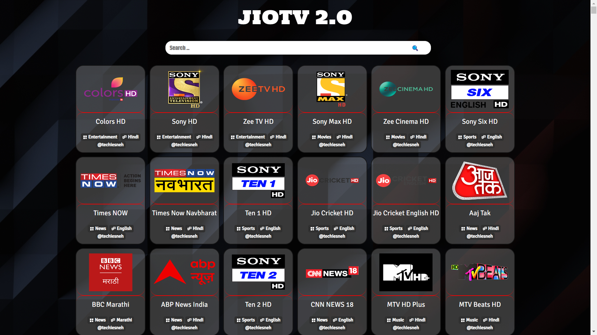
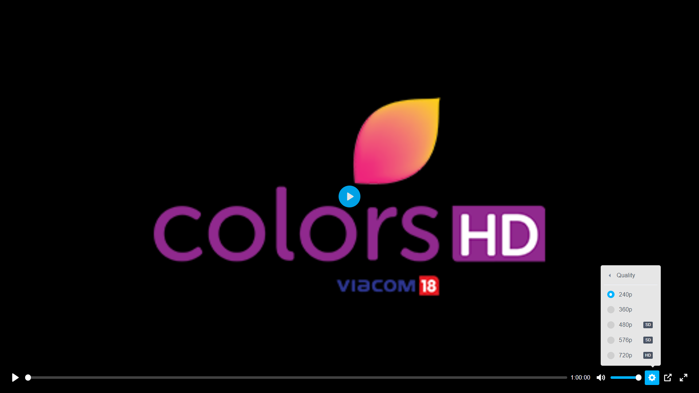
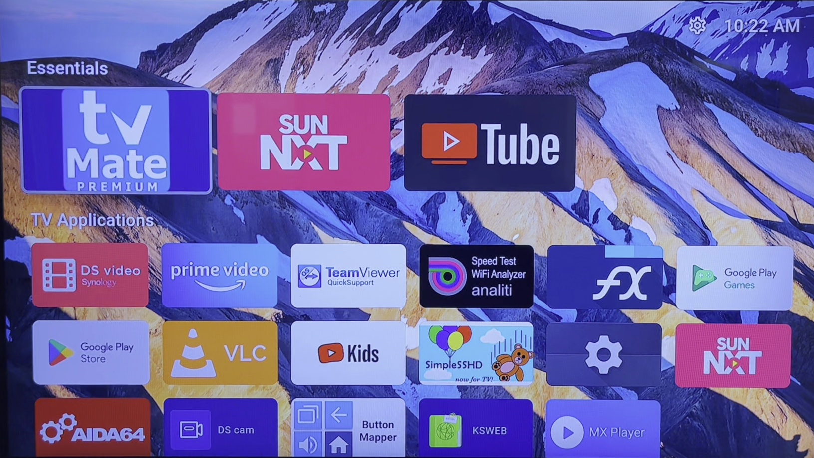
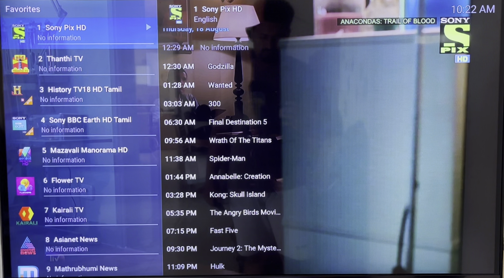

<!-- DO NOT EDIT FILE AND ADD YOU NAME HERE AND PUBLISH -->
<!-- © 2021-22 TechieSneh -->

<h1 align='center'>Jɪᴏ IPTV Server</h1>
<h4 align='center'>A Jio IPTV server based on Apache and PHP server than can be run on Android TV and Android things to stream Jio IPTV channels</h4>
<br>
<h2>Description</h2>
Why need to pay for monthly TV subscription to Airtel, DishTV, Tata Sky or even Jio when you are already using an Jio postpaid or prepaid number and have an internet connection at home? <br>
Kudos to the author  <a href="https://github.com/mitthu786">mitthu786</a> for developing this script, I am just a better documenter<br>
Please do star <a href="https://github.com/mitthu786">mitthu786</a> and my repository<br>

<h2>Features</h2>
&ensp; - Supports streaming IPTV in Auto, 250p, 400p, 600p, 800p, 1200p<br>
&ensp; - Remote play and IPTV clients support<br>
&ensp; - Works on mobile, Android TV or PC internet browser<br>
&ensp; - Search channels by Channels, Genre and Language<br>
&ensp; - Themes support for the remote play portal<br>

<h2>How To Use</h2>
I am just concentrating on configuring Android TV's in this document to not confuse the users reading this <br>
BTW you need atleast 2Mbps internet bandwidth alocatted just for Android TV for smooth and HD streaming experience.<br>
<br>
Steps

1. Install the following android apps from google play store<br>
  a. 'KSWEB: web developer kit', the author of this script recommends using  paid/PRO version<br>
  b. Tivimate or OTT Navigator Player, I recommend using the paid version as this it has the closest/similar interface of using ideal TV setup box<br>

2. Download the [JioTV zip](https://github.com/mitthu786/TS-JioTV/blob/main/tsjiotv.zip?raw=true) file<br>
  a. Extract the 'tsjiotv' folder inside the tsjiotv.zip and copy it to 'htdocs' directory <br>
  As per my 'Airtel xstream Android TV Box' the 'htdocs' location looks like this

    ```py
    /mnt/sdcard/htdocs
    ```

  After you have pasted the 'tsjiotv' folder, the directory structure of the 'htdocs' directory should look like this
    
    ```py
    /mnt/sdcard/htdocs/tsjiotv/
    ```

3. Configure the 'KSWEB Pro' <br>
  a. Open 'KSWEB Pro' and disable all the service except Apache and PHP <br>
  b. Goto 'Apache' section and edit the configuration file to run the Apache server to run on port 8080 <br>
  c. Goto 'Setting' section and enable 'Auto start', 'Start minimized' and 'Turn off battery saving' (you may need to follow few more steps to turn off battery saving in Android settings) <br>
  d. Goto 'Status' section and note down the private ip address of your 'Android TV' that looks somethings like this '192.168.x.x' <br>

4. Login to JioTV server with your Jio credentials, just for the first time <br>
  a. Using the 'Android TV' internet browser <br>

     ```py
     http://localhost:8080/tsjiotv/login.php
     ```

  b. Using your mobile, iPad or PC's internet browser <br>
     Your JioTV server ip is same as the 'Android TV' private ip we noted down earlier <br>

     ```py
     http://<your_private_ip>:8080/tsjiotv/login.php
     ```

5. Open Tivimate or OTT Navigator Player and configure the IPTV playlist<br>
  a. Select local playlist option and choose the 'localplaylist.m3u' file from the htdocs/tsjiotv directory <br>
  b. in case your IPTV video is lagging/buffering or you don't have the required internet bandwidth to stream smoothly, then choose the default required resolution from one the playlist at htdocs/tsjiotv directory.<br>
  c. Optionally, you can configure to auto start Tivimate or OTT Navigator on Android TV boot or waking from sleep and start playing TV channels as any TV setup box would do. <br>

Hurrah !! Now Play & Enjoy streaming TV Channels.<br>

<h2>Screenshots</h2>

<table>
  <tr>
    <td></td>
    <td></td>
  </tr>
  <tr>
    <td></td>
    <td></td>
  </tr>  
  <tr>
    <td></td>
    <td></td>
  </tr>
</table>

<br>

<h2>Disclaimer</h2>
&ensp; - This is Just For Educational Purpose <br>
&ensp; - I am not the author of this script, so I don't know if this script injects or collects information from us, use at your own risk.
